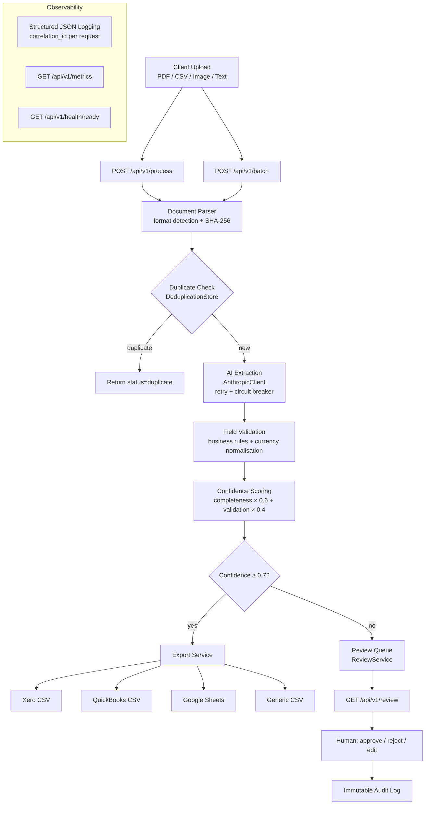

# AI Invoice Processing Pipeline

## PDF → Structured Data → Validation → Accounting Export

**70% less finance admin time** | **<3% field error rate target** | **Automatic duplicate detection**

A production-grade API that converts unstructured invoices (PDF, CSV, image, plain text) into validated, structured data and exports directly into accounting systems (Xero, QuickBooks, Google Sheets).

---

## The Problem

Finance teams at growing companies spend 15–20 hours per week on manual invoice processing:

- **Manual data entry** from PDFs into accounting software — error-prone, 3–7% keystroke error rate
- **Duplicate invoices** slipping through and being paid twice (industry average: 0.1–0.5% of invoices)
- **No audit trail** for who approved what and when
- **Inconsistent validation** — different staff members interpret ambiguous invoices differently
- **Multi-currency complexity** — manually converting symbols, codes, and foreign date formats
- **Re-keying** the same data into multiple systems (ERP, Xero, spreadsheets)

The cost: approximately £2,000/month in staff time for a 50-person company processing 200 invoices/month, plus exposure to duplicate payments and compliance gaps.

---

## The Solution

```
Invoice (PDF / email / scan / CSV)
        ↓
  [ Parse & Hash ]  ← detect format, extract text, compute SHA-256
        ↓
  [ Deduplicate ]   ← reject if hash already seen (content-addressed)
        ↓
  [ AI Extract ]    ← Claude extracts fields with per-field confidence
        ↓
  [ Validate ]      ← business rules: amounts > 0, dates valid, totals match
        ↓
  [ Score ]         ← composite confidence (completeness × validation)
        ↓
  [ Route ]         ← high confidence → export; low confidence → review queue
        ↓
  [ Export ]        ← Xero CSV / QuickBooks CSV / Google Sheets / JSON API
```

Low-confidence invoices (score < 0.7) enter a human review queue with approve/reject/edit actions, all logged to an immutable audit trail.

---

## Architecture



### Component Map

| Layer | Component | Responsibility |
|---|---|---|
| **API** | `routes/process.py`, `routes/batch.py` | Input validation, response shaping |
| **Parsing** | `services/parsing/` | Format detection, text extraction, SHA-256 |
| **AI** | `services/ai/client.py` | Retry, circuit breaker, cost tracking |
| **Extraction** | `services/extraction_service.py` | Pipeline orchestration |
| **Validation** | `services/validation_service.py` | Business rules, currency normalisation |
| **Confidence** | `services/confidence_service.py` | Composite scoring |
| **Dedup** | `services/deduplication.py` | In-memory SHA-256 store |
| **Export** | `services/export_service.py` | Xero, QuickBooks, Sheets, CSV |
| **Review** | `services/review_service.py` | Queue management, audit trail |
| **Batch** | `services/batch_service.py` | Per-document error isolation |

---

## Evaluation Results

The evaluation pipeline (`make evaluate`) runs 35 labelled test cases across 6 categories against the live Claude API.

> **Important:** The JSON block below is a **dry-run placeholder** generated **without an API key**.  
> These `0.0` metrics **do not represent real model performance**.  
> Run `make evaluate` with a valid `ANTHROPIC_API_KEY` to produce actual evaluation results.

```json
{
  "timestamp": "2026-03-28T14:25:37+00:00",
  "model": "claude-3-5-sonnet-20241022",
  "prompt_version": "v1",
  "test_cases": 35,
  "overall_accuracy": 0.0,
  "field_accuracy": {
    "vendor": 0.0,
    "invoice_id": 0.0,
    "date": 0.0,
    "amount": 0.0,
    "currency": 0.0,
    "due_date": 0.0,
    "line_items": 0.0
  },
  "cross_field_consistency": 0.0,
  "avg_latency_ms": 0.0,
  "avg_cost_per_invoice_usd": 0.0,
  "total_cost_usd": 0.0
}
```

> Results are `0.0` because this output was generated with `--dry-run` (no API key).  
> Set `ANTHROPIC_API_KEY` and run `make evaluate` to obtain real accuracy figures.

### Test Set Breakdown

| Category | Cases | Coverage |
|---|---|---|
| Standard | 10 | Full invoices — USD/GBP/EUR, 1–3 line items, PO numbers |
| Partial info | 5 | Missing invoice ID, due date, or currency |
| Multi-currency | 5 | EUR, GBP, JPY (¥550,000 no-decimal), CAD, CHF |
| Line-item heavy | 5 | 4–8 items with quantities, VAT, discounts |
| Edge cases | 5 | Long names, British dates, French language, multi-reference |
| Adversarial | 5 | Prompt injection, cancelled IDs, conflicting totals, credit notes |

---

## Key Features

### Multi-Format Parsing
Accepts PDF (pdfplumber), CSV (auto-delimiter detection), plain text, and image files. All parsers return a `ParsedDocument` with a stable SHA-256 content hash for deduplication.

### AI Extraction with Cost Control
- **Versioned prompts** — v1 extracts 4 core fields; v2 adds line items, due date, subtotal, tax, and per-field confidence scores
- **Retry with exponential backoff** on transient API errors
- **Circuit breaker** opens after N consecutive failures (configurable threshold)
- **Daily cost limit** (`MAX_DAILY_COST_USD`) — new requests are refused, not crashed, when the budget is exhausted
- Every AI call logs: model, tokens\_in, tokens\_out, cost\_usd, latency\_ms

### Confidence Scoring
```
completeness    = fields_present / required_fields          (vendor, id, date, amount)
validation_score = 1.0 if validation_passed else 0.0
confidence      = (completeness × 0.6) + (validation_score × 0.4)
```
Invoices below the configurable threshold (default 0.7) route to the human review queue rather than exporting automatically.

### Cross-Field Validation
- Required fields present (vendor, invoice\_id, date, amount)
- Amount must be > 0
- Date formats: ISO 8601, DD/MM/YYYY, MM/DD/YYYY, "01 March 2026", etc.
- Due date must not precede invoice date
- `sum(line_items.total) + tax ≈ total` within £0.02 tolerance
- Currency symbols/names normalised to ISO 4217 codes

### Batch Processing
`POST /api/v1/batch` accepts multiple files. Each document is processed independently via `asyncio.gather` — a single failure does not abort the remaining documents. Results include per-document status, confidence, and error message.

### Human Review Queue
Low-confidence invoices enter a queue at `GET /api/v1/review`. Operators approve, reject, or edit extractions. All actions are written to an immutable audit log with actor, timestamp, and field-level changes.

### Export Formats
- **Xero CSV** — Bills import (`*ContactName`, `*InvoiceNumber`, `*UnitAmount`, `*AccountCode`)
- **QuickBooks CSV** — Online import (`Vendor`, `Invoice Number`, `Amount`, `Account`)
- **Generic CSV** — Pipeline output with confidence and validation columns
- **Google Sheets** — Async row append via Sheets API client

---

## Tech Stack

| Category | Choice | Why |
|---|---|---|
| Runtime | Python 3.12, FastAPI | Async-first, typed, excellent ecosystem |
| AI | Anthropic Claude 3.5 Sonnet | Best-in-class instruction following for structured extraction |
| Validation | Pydantic v2 | Runtime type safety at all data boundaries |
| PDF parsing | pdfplumber | Reliable text extraction with layout awareness |
| Database | PostgreSQL + SQLAlchemy 2.0 async | Production-ready async ORM |
| Migrations | Alembic | Schema versioning with async support |
| Testing | pytest + pytest-asyncio | 312 tests, asyncio\_mode=auto, no decorator boilerplate |
| Linting | ruff | Replaces flake8 + isort + pyupgrade in one tool |
| Types | mypy | Strict checking across 53 source files, 0 errors |
| Containers | Docker multi-stage, non-root | Reproducible, minimal attack surface |

---

## How to Run

### Prerequisites
- Docker and Docker Compose installed
- Anthropic API key — [get one here](https://console.anthropic.com)

### 1. Clone and configure

```bash
git clone <repo-url>
cd invoice-processing-automation
cp .env.example .env
# Edit .env — set ANTHROPIC_API_KEY=sk-ant-...
```

### 2. Start the stack

```bash
docker-compose up --build
```

This starts the **API** on `http://localhost:8000` and **PostgreSQL** on `localhost:5432`. Both services include health checks; the app waits for the database to be healthy before starting.

### 3. Verify

```bash
curl http://localhost:8000/api/v1/health
# {"status":"healthy","timestamp":"...","version":"1.0.0"}

curl http://localhost:8000/api/v1/health/ready
# {"status":"ready","checks":{"ai_provider":"ok","database":"ok"}}
```

### 4. Process an invoice

```bash
# Single invoice
curl -X POST http://localhost:8000/api/v1/process \
  -F "file=@tests/fixtures/sample_inputs/standard_invoice.txt"

# Batch
curl -X POST http://localhost:8000/api/v1/batch \
  -F "files=@tests/fixtures/sample_inputs/standard_invoice.txt" \
  -F "files=@tests/fixtures/sample_inputs/multi_currency_invoice.txt"
```

### 5. Interactive docs

```
http://localhost:8000/docs
```

### Development

```bash
make test             # 312 tests (~1s)
make lint             # ruff check + format check
make format           # auto-format
make typecheck        # mypy (0 errors)
make evaluate         # run eval against real Claude API
make evaluate-dry-run # run eval without API key
```

---

## Architecture Decisions

| Decision | Choice | Rationale |
|---|---|---|
| In-memory dedup vs. DB | In-memory | Zero latency; DB models exist for scale-out when needed |
| AI vs. regex extraction | Claude AI | Invoices vary too much for reliable regex |
| Sync pipeline vs. queue | Synchronous | Optimised for low latency and operational simplicity; queueing is an upgrade path, not a requirement |
| Per-document error isolation | Always on | One corrupt file must never block 99 good ones in a batch |
| Confidence threshold | 0.7 (configurable) | Tuned to balance automation rate vs. review load |
| Two prompt versions | v1 (core) + v2 (rich) | v1 for cost/speed; v2 for line items — choose per deployment |
| Currency normalisation | In validation stage | AI returns raw strings; normalisation is deterministic, belongs in code |

See [docs/decisions/](docs/decisions/) for full Architecture Decision Records.

---

## Configuration

Full documentation in [.env.example](.env.example). Key variables:

| Variable | Default | Description |
|---|---|---|
| `ANTHROPIC_API_KEY` | *(required)* | Anthropic API key |
| `AI_MODEL` | `claude-3-5-sonnet-20241022` | Model identifier |
| `MAX_DAILY_COST_USD` | `10.0` | Hard daily spend cap; requests refused above this |
| `CONFIDENCE_REVIEW_THRESHOLD` | `0.7` | Route to human review below this score |
| `APPROVAL_THRESHOLD` | `500.0` | Flag invoices above this amount |
| `DATABASE_URL` | *(optional)* | PostgreSQL async connection string |
| `SLACK_WEBHOOK_URL` | *(optional)* | Slack notifications on processing events |

---

## Project Structure

```
├── app/
│   ├── api/              # FastAPI routes + schemas
│   ├── core/             # Exceptions, structured logging
│   ├── db/               # SQLAlchemy models, session management
│   ├── integrations/     # Airtable, Google Sheets clients
│   ├── models/           # Pydantic data models
│   └── services/         # Business logic
│       ├── ai/           # Client wrapper + versioned prompts
│       └── parsing/      # PDF, CSV, image, text parsers
├── tests/
│   ├── fixtures/sample_inputs/  # Sample invoices for automated tests
│   ├── integration/             # Pipeline + HTTP endpoint tests
│   └── unit/                    # Service unit tests (312 total)
├── eval/
│   ├── test_set.jsonl   # 35 labelled evaluation cases
│   └── results/         # Timestamped JSON eval reports
├── scripts/
│   └── evaluate.py      # Evaluation pipeline CLI
├── migrations/          # Alembic schema migrations
├── docs/                # Architecture, ADRs, runbook
├── Dockerfile           # Multi-stage, non-root, HEALTHCHECK
├── docker-compose.yml   # App + PostgreSQL
└── Makefile
```

---
