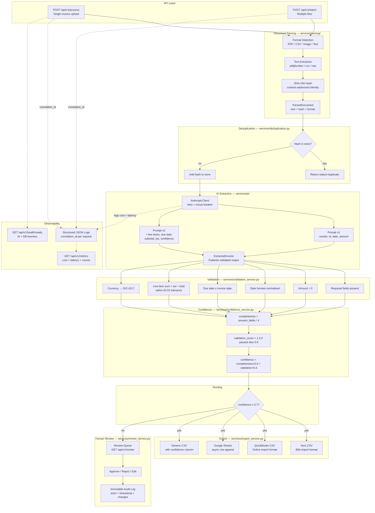

# Architecture

## System Overview

The invoice processing pipeline converts unstructured invoice documents into validated, structured data and routes them to accounting systems or a human review queue.

## Full Pipeline Flow



## Component Responsibilities

### API Layer (`app/api/routes/`)

Routes are thin: validate incoming HTTP parameters, call one service, shape the response. No business logic.

| Route file | Responsibility |
|---|---|
| `process.py` | Single-document upload → pipeline |
| `batch.py` | Multi-document upload → batch service |
| `review.py` | Queue list + action endpoint |
| `health.py` | Liveness + readiness + metrics |

### Document Parsing (`app/services/parsing/`)

Format detection is done by inspecting the file extension and MIME type of the uploaded file. Each parser returns a `ParsedDocument`:

```
ParsedDocument
  text: str           — extracted plain text
  content_hash: str   — SHA-256 hex digest
  format: str         — "pdf" | "csv" | "image" | "text"
  filename: str
```

The SHA-256 hash is computed over raw file bytes, not extracted text, ensuring the hash is stable regardless of parser behaviour.

### AI Extraction (`app/services/ai/`)

`AnthropicClient` is a wrapper around the Anthropic SDK with:
- **Retry with exponential backoff** — transient 5xx and rate-limit errors are retried up to `MAX_RETRIES` times
- **Circuit breaker** — opens after `CIRCUIT_BREAKER_THRESHOLD` consecutive failures; all calls immediately raise `CircuitBreakerOpenError` while open
- **Cost tracking** — every call records `tokens_in`, `tokens_out`, `cost_usd`, `latency_ms` and accumulates a daily total; new calls raise `CostLimitExceededError` when `MAX_DAILY_COST_USD` is reached

Two prompt versions:
- **v1** — extracts vendor, invoice_id, date, amount, currency
- **v2** — additionally extracts line_items, due_date, subtotal, tax, per-field confidence scores

### Validation (`app/services/validation_service.py`)

Pure function: `ValidationResult validate(ExtractedInvoice) -> ValidationResult`.

Validation checks run independently; all failures are collected and returned together (not short-circuited). Currency normalisation maps symbols and names to ISO 4217 codes.

### Confidence Scoring (`app/services/confidence_service.py`)

```
completeness     = len(present_required_fields) / 4
                   required: vendor, invoice_id, date, amount

validation_score = 1.0 if all validations passed else 0.0

confidence       = (completeness × 0.6) + (validation_score × 0.4)
```

The 0.6/0.4 split weights completeness (data is there) over validation (data is correct), because partially complete invoices are more recoverable via human review than invoices with corrupted data.

### Export (`app/services/export_service.py`)

All formats are generated as in-memory strings (no temp files). Format selection is via the `format` query parameter on the process endpoint. Google Sheets integration is async and calls the Sheets API directly.

### Review Queue (`app/services/review_service.py`)

Low-confidence invoices are stored in-memory (with DB models for persistence at scale). The queue exposes list and action endpoints. All actions — approve, reject, edit — are appended to an immutable `AuditLog` list. Edits record field-level diffs.

## Data Flow: Single Invoice

```
POST /api/v1/process
  → parse_document(file_bytes)          → ParsedDocument
  → dedup_store.check(content_hash)     → bool
  → ai_client.complete(prompt, text)    → raw JSON
  → validate_invoice(extracted)         → ValidationResult
  → score_confidence(extracted, result) → float
  → route:
      score ≥ 0.7 → export_service.export(extracted, format)
      score < 0.7 → review_service.enqueue(extracted)
  → return PipelineResult
```

## Data Flow: Batch

```
POST /api/v1/batch
  → for each file:
      asyncio.gather(_process_one(file))  ← concurrent, isolated
        → same single-invoice pipeline
        → on any exception: mark document failed, continue
  → return BatchResult(documents=[...])
```

## Dependency Injection

All stateful objects (AI client, dedup store, metrics tracker, review service) are injected via FastAPI `Depends()`. The dependency providers live in `app/dependencies.py`. This enables clean test overrides via `app.dependency_overrides`.

```python
# app/dependencies.py
def get_ai_client() -> AnthropicClient: ...
def get_dedup_store() -> DeduplicationStore: ...
def get_metrics_tracker() -> MetricsTracker: ...
def get_review_service() -> ReviewService: ...
def get_batch_service(...) -> BatchService: ...
```

## Error Hierarchy

```
BaseAppError (status_code, error_code, message, context)
├── PDFParseError
├── ExtractionError
├── ValidationError
├── CircuitBreakerOpenError
└── CostLimitExceededError
```

`process_invoice` catches `PDFParseError` and `ExtractionError` (expected pipeline failures), returns `PipelineResult(status="failed")`. `CircuitBreakerOpenError` and `CostLimitExceededError` propagate to the batch layer where `_process_one` catches all exceptions, marking the document failed without aborting the batch.
